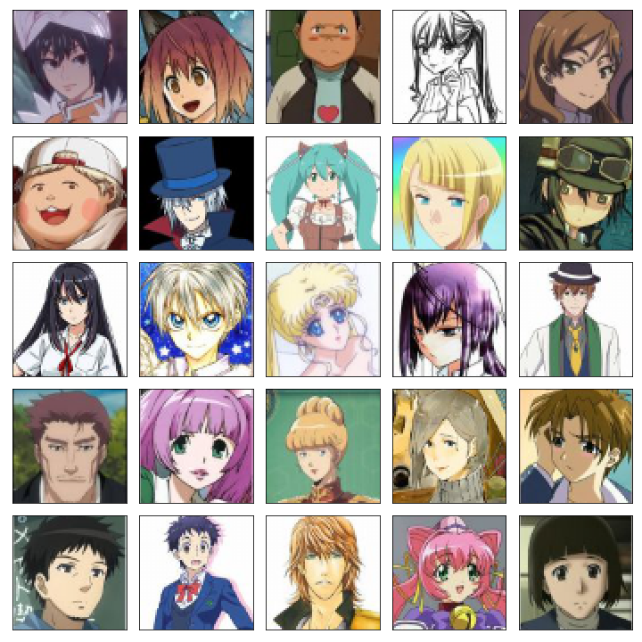

# Anime GAN
### By: Shockblack/Aiden Zelakiewicz 

This repository houses the model architecture I used to create my Generative Adversarial Network to synthesize anime faces! I have seen other models do something similar, but they use only characters from the 90s, so I wanted to spice it up with newer images. The characters were all scraped from [MAL](https://myanimelist.net) and detected for facial features using a Faster-RCNN from user [@qhgz2013](https://github.com/qhgz2013/anime-face-detector) on GitHub. The images were downloaded in their original size from MAL, but cropped to 64x64 to make it easier for training, like so.

<figure>

<figcaption align='center'>
Images used in training
</figcaption>
</figure>

The model uses a convolutional framework similar to the DCGAN framework, but utilizes spectral normalization on the convolution layers. This was originally was going to use the LSGAN loss function, but I broke the model at some point so just fell back to BCE because I couldn't figure out what happened. The model can be found in [model.py](model.py) with their components in [blocks.py](blocks.py). [Train.py](train.py) houses the main training loop for the whole model. Here is a silly goofy gif of the training of 300 epochs. The images become cursed after ~100 epochs, but I think it's still interesting to include.
